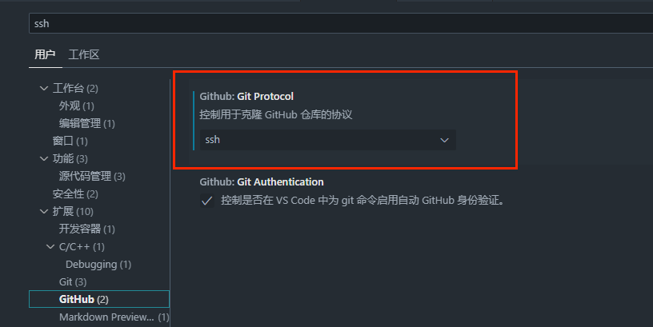

title: gitee使用指南
author: Zhao Dong
date: 2023-08-27 20:12:19
tags:
	- git
	- markdown

categories:  git使用
---

## 一、新建仓库

### **官方给出的指南**


## github push超时

### 问题现象

> Failed to connect to github.com port 443 after 39677 ms

### 解决方法

#### 确保你的机器可以访问 GitHub

> 特别是端口 443。可以尝试通过浏览器或命令行（例如 curl）直接访问 GitHub

```bash
curl -I https://github.com
```

#### 检查 GitHub 状态

> 偶尔 GitHub 服务本身可能会出现问题，可以访问 GitHub 的状态页面来确认是否存在故障：[GitHub Status](https://www.githubstatus.com/)

## VSCode设置github拉取协议



## SSH访问Github

#### 1. 生成 SSH 密钥对

打开 Git Bash（Windows）或者终端（Linux/macOS），运行以下命令生成 SSH 密钥对，把 `your_email@example.com` 替换成你在 GitHub 注册的邮箱：

```bash
ssh-keygen -t ed25519 -C "your_email@example.com"
```

按照提示操作，例如选择保存密钥的位置和设置密码（可直接按回车键使用默认设置）

#### 2. 将公钥添加到 GitHub 账户

- 复制公钥内容。在终端中运行以下命令（Windows 可使用 Git Bash）：

```bash
# 对于 Linux/macOS
cat ~/.ssh/id_ed25519.pub

# 对于 Windows
type %userprofile%\.ssh\id_ed25519.pub
```


- 登录 GitHub 账户，点击右上角头像，选择 “Settings”。
- 在左侧导航栏中选择 “SSH and GPG keys”。
- 点击 “New SSH key”，将复制的公钥内容粘贴到 “Key” 字段，为密钥添加一个描述（例如电脑名称），然后点击 “Add SSH key”


#### 3. 配置并启动 SSH 代理

ssh-agent的原理参考文档 : [SSH Agent的工作原理](转载文档/(转)理解SSHAgent的工作原理与应用场景-腾讯云开发者社区-腾讯云.md)

- 启动 SSH 代理：

```bash
# 对于 Linux/macOS
eval "$(ssh-agent -s)"

# 对于 Windows（使用 Git Bash）
eval $(ssh-agent -s)
```


- 将私钥添加到 SSH 代理：

```bash
ssh-add ~/.ssh/id_ed25519

```

#### 4. 测试 SSH 连接

完成上述步骤后，可使用以下命令测试 SSH 连接：

```bash
ssh -T git@github.com
```

若看到类似 `Hi username! You've successfully authenticated, but GitHub does not provide shell access.` 的提示信息，说明 SSH 连接已成功配置


## SSH 的congfig文件

### 文件位置

~/.ssh/config

### 作用

指定公钥文件，端口、代理等。

### 示例

```json
//config文件内容
Host github.com
    port 22
    User git
    HostName github.com
    PreferredAuthentications publickey
    IdentityFile ~/.ssh/id_rsa_github
    # 添加下面这一行，端口号为你开启代理的端口号，这里7897是Clash默认端口号
    ProxyCommand connect -S 127.0.0.1:7897 -a none %h %p

```


## SSH 访问Github常见问题

### Permission denied (publickey)

#### 现象

```cmd
git@github.com: Permission denied (publickey)
```

#### 原因

用SSH协议连接Github，公钥认证环节失败

#### 解决方法

参考 [SSH访问Github](#SSH访问Github)添加公钥


### Connection timed out

#### 现象

```cmd
ssh git@github.com
ssh: connect to host github.com port 22: Connection timed out
```


#### 原因及解决方法

##### 防火墙（大概率）

> 公司、学校网络或者家庭网络的防火墙可能会阻止对端口 22 的访问，使用的代理配置不正确也会导致连接失败

解决方法：

GitHub 还提供了备用的 SSH 端口 443，可以用443端口访问

```
ssh -T -p 443 git@github.com

```

也可以修改~/.ssh/config文件中的端口

```
Host github.com
  Hostname ssh.github.com
  Port 443
```

##### 代理设置（大概率）

有些代理可能会影响，不过正确设置了代理可以解决次问题

如果确实设置代理可以参考

```json
//config文件内容
Host github.com

    # 添加下面这一行，端口号为你开启代理的端口号，这里7897是Clash默认端口号
    ProxyCommand connect -S 127.0.0.1:7897 -a none %h %p
```


##### DNS 解析问题（大概率）

> `github.com` 的 IP 地址访问不了

解决方法：

一般来说[防火墙（大概率）](#防火墙（大概率）)和[代理设置（大概率）](#代理设置（大概率）)可以解决此问题。

也可以通过设置hosts文件，修改github.com的ip来解决。

github.com的ip查询可以参考网站https://dnschecker.org/

> 注：可以通过nslookup github.com 8.8.8.8（dns服务器地址）查看当前github.com对应的ip

#### 


