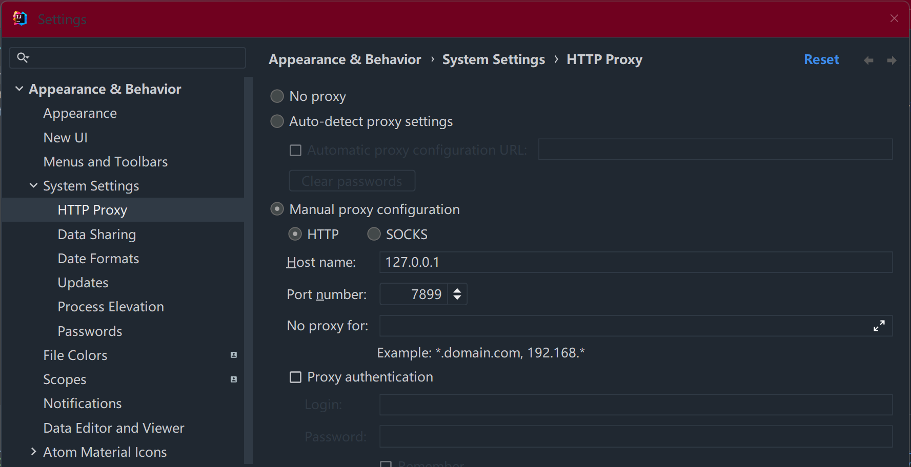
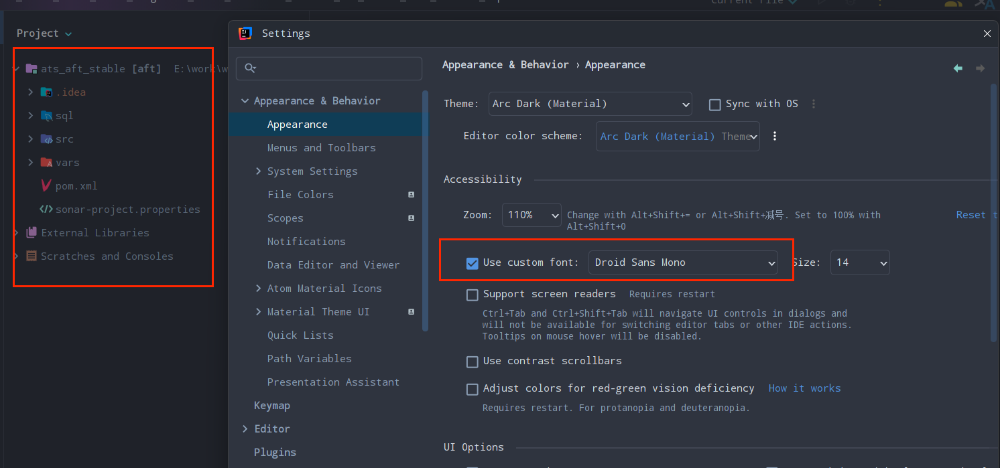

## IDEA 去除无用的 import 的快捷键 

```
Ctrl+Alt+O
```

## IDEA ulimate版关闭报错

> 根据关闭报错信息找到报错位置
>
> Library/Application Support/JetBrains/IntelliJIdea2023.3
>
> 删除此目录 重新安装idea即可

## IDEA和gradle低版本的对应关系

项目中gradle版本较低，例如2.14。如果用最新的idea导入项目，会有不兼容的问题。使用兼容低版本的gradle的IDEA可以解决此问题

| 序号 | IDEA版本           | gradle版本 |
| ---- | ------------------ | ---------- |
| 1    | IDEA 2019.2.4 JBR8 | 2.14       |


## IDEA中使用代理科学上网

> gradle的项目使用的仓库地址大多是外网，浏览器可以正常访问，但是IDEA里访问不了。配置IDEA使用本机的代理。clash软件的端口是7899。HOST使用127.0.0.1即可。



## 设置菜单导航公共部分字体

Appearance --> Use custom font




