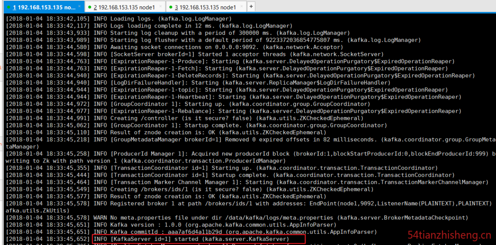
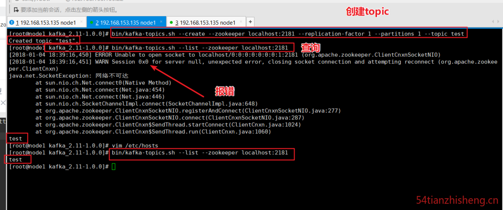
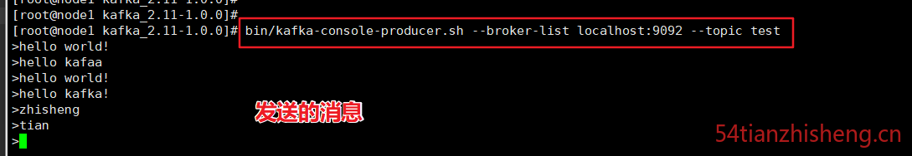
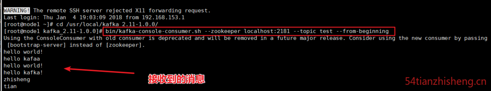
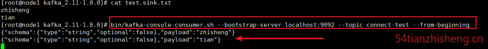
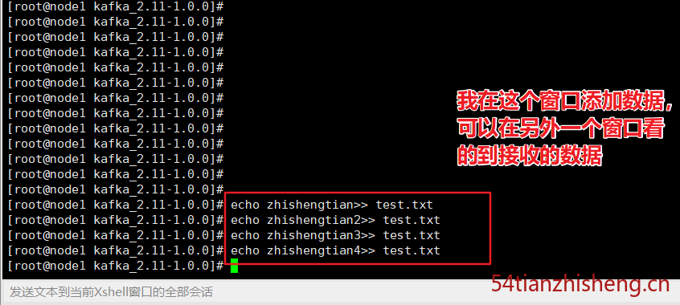

### 介绍

官网：[http://kafka.apache.org/](https://link.segmentfault.com/?enc=gHv9H%2BiQXVFf7S2JSjDdoQ%3D%3D.EiZOaKroOu2zytWkTdlsScyYLgedUcoDjoEeFtk%2Fijc%3D)

Apache Kafka是分布式发布-订阅消息系统。它最初由LinkedIn公司开发，之后成为Apache项目的一部分。Kafka是一种快速、可扩展的、设计内在就是分布式的，分区的和可复制的提交日志服务。

Apache Kafka与传统消息系统相比，有以下不同：

-   它被设计为一个分布式系统，易于向外扩展；
-   它同时为发布和订阅提供高吞吐量；
-   它支持多订阅者，当失败时能自动平衡消费者；
-   它将消息持久化到磁盘，因此可用于批量消费，例如ETL，以及实时应用程序。

### 安装 kafka

下载地址：[https://kafka.apache.org/down...](https://link.segmentfault.com/?enc=cS4PMixixOolTn1swf3KCg%3D%3D.wfqKjOR5tAn%2FoupQ9RkxaHvjFtRoHjpOddB2MFXr5e2weUU5lF51sfftohZED5Se)

```
wget http://mirrors.shuosc.org/apache/kafka/1.0.0/kafka_2.11-1.0.0.tgz
```

解压：

```
tar -zxvf kafka_2.11-1.0.0.tgz

cd /usr/local/kafka_2.11-1.0.0/
```

修改 kafka-server 的配置文件

```
vim /usr/local/kafka/config/server.properties
```

修改其中的：

```
broker.id=1
log.dir=/data/kafka/logs-1
```

### 功能验证：

#### 1、启动 zk

使用安装包中的脚本启动单节点 Zookeeper 实例：

```
bin/zookeeper-server-start.sh -daemon config/zookeeper.properties
```

#### 2、启动Kafka 服务

使用 `kafka-server-start.sh` 启动 kafka 服务：

```
bin/kafka-server-start.sh  config/server.properties
```



#### 3、创建 topic

使用 `kafka-topics.sh` 创建单分区单副本的 topic test：

```
bin/kafka-topics.sh --create --zookeeper localhost:2181 --replication-factor 1 --partitions 1 --topic test
```

查看 topic 列表：

```
bin/kafka-topics.sh --list --zookeeper localhost:2181
```

查询创建的 topic 列表报错：



解决方法:

```
vim /etc/hosts
```

将 host 里的

```
127.0.0.1   localhost localhost.localdomain localhost4 localhost4.localdomain4
::1         localhost localhost.localdomain localhost6 localhost6.localdomain6
```

修改为：

```
127.0.0.1   localhost localhost.localdomain localhost4 localhost4.localdomain4
::1         ip6-localhost ip6-localhost.localdomain localhost6 localhost6.localdomain6
```

方法参考：[zookeeper unable to open socket to localhost/0:0:0:0:0:0:0:1:2181](https://link.segmentfault.com/?enc=974iDR%2B9%2FXPbO6nynhXE%2FA%3D%3D.iiFN3Hn2yS2Sux9cncBylWV3QXwcwwyvRAEmVxEzvM3AcgX8WPu1rHzR8kRF4IwcTMTw7D6YGXqpUAEQgvLULmrcZ9E5tvymfqbtTIEtYDfBlOBBtMqdOK43z5w%2FaqAsPS515BOaWMPtCgMmuAzfVQ%3D%3D)

再次查询就不报错了。

#### 4、产生消息

使用 `kafka-console-producer.sh` 发送消息：

```
bin/kafka-console-producer.sh --broker-list localhost:9092 --topic test
```



#### 5、消费消息

使用 `kafka-console-consumer.sh` 接收消息并在终端打印：

```
bin/kafka-console-consumer.sh --zookeeper localhost:2181 --topic test --from-beginning
```

打开个新的命令窗口执行上面命令即可查看信息：



#### 6、查看描述 topics 信息

```
bin/kafka-topics.sh --describe --zookeeper localhost:2181 --topic test
```

结果：

```
Topic:test    PartitionCount:1    ReplicationFactor:1    Configs:
    Topic: test    Partition: 0    Leader: 1    Replicas: 1    Isr: 1
```


第一行给出了所有分区的摘要，每个附加行给出了关于一个分区的信息。 由于我们只有一个分区，所以只有一行。

“Leader”: 是负责给定分区的所有读取和写入的节点。 每个节点将成为分区随机选择部分的领导者。

“Replicas”: 是复制此分区日志的节点列表，无论它们是否是领导者，或者即使他们当前处于活动状态。

“Isr”: 是一组“同步”副本。这是复制品列表的子集，当前活着并被引导到领导者。

### 集群配置

Kafka 支持两种模式的集群搭建：可以在单机上运行多个 broker 实例来实现集群，也可在多台机器上搭建集群，下面介绍下如何实现单机多 broker 实例集群，其实很简单，只需要如下配置即可。

#### 单机多broker 集群配置

利用单节点部署多个 broker。 不同的 broker 设置不同的 id，监听端口及日志目录。 例如：

```
cp config/server.properties config/server-2.properties

cp config/server.properties config/server-3.properties

vim config/server-2.properties

vim config/server-3.properties
```

修改 ：

```
broker.id=2

listeners = PLAINTEXT://your.host.name:9093

log.dir=/data/kafka/logs-2
```

和

```
broker.id=3

listeners = PLAINTEXT://your.host.name:9094

log.dir=/data/kafka/logs-3
```

启动Kafka服务：

```
bin/kafka-server-start.sh config/server-2.properties &;

bin/kafka-server-start.sh config/server-3.properties &;
```

至此，单机多broker实例的集群配置完毕。

#### 多机多 broker 集群配置

分别在多个节点按上述方式安装 Kafka，配置启动多个 Zookeeper 实例。

假设三台机器 IP 地址是 ： 192.168.153.135， 192.168.153.136， 192.168.153.137

分别配置多个机器上的 Kafka 服务，设置不同的 broker id，zookeeper.connect 设置如下:

```
vim config/server.properties
```

里面的 `zookeeper.connect`

修改为：

```
zookeeper.connect=192.168.153.135:2181,192.168.153.136:2181,192.168.153.137:2181
```

### 使用 Kafka Connect 来导入/导出数据

从控制台写入数据并将其写回控制台是一个方便的起点，但您可能想要使用其他来源的数据或将数据从 Kafka 导出到其他系统。对于许多系统，您可以使用 Kafka Connect 来导入或导出数据，而不必编写自定义集成代码。

Kafka Connect 是 Kafka 包含的一个工具，可以将数据导入和导出到 Kafka。它是一个可扩展的工具，运行 连接器，实现与外部系统交互的自定义逻辑。在这个快速入门中，我们将看到如何使用简单的连接器运行 Kafka Connect，这些连接器将数据从文件导入到 Kafka topic，并将数据从 Kafka topic 导出到文件。

首先，我们将通过创建一些种子数据开始测试：

```
echo -e "zhisheng\ntian" &gt; test.txt
```


接下来，我们将启动两个以独立模式运行的连接器，这意味着它们将在单个本地专用进程中运行。我们提供三个配置文件作为参数。首先是 Kafka Connect 过程的配置，包含常见的配置，例如要连接的 Kafka 代理以及数据的序列化格式。其余的配置文件都指定一个要创建的连接器。这些文件包括唯一的连接器名称，要实例化的连接器类以及连接器所需的任何其他配置。

```
bin/connect-standalone.sh  config/connect-standalone.properties config/connect-file-source.properties config/connect-file-sink.properties
```

Kafka 附带的这些示例配置文件使用您之前启动的默认本地群集配置，并创建两个连接器：第一个是源连接器，用于读取输入文件中的行，并将每个连接生成为 Kafka topic，第二个为连接器它从 Kafka topic 读取消息，并在输出文件中产生每行消息。

在启动过程中，您会看到一些日志消息，其中一些指示连接器正在实例化。Kafka Connect 进程启动后，源连接器应该开始读取 test.txt topic connect-test，并将其生成 topic ，并且接收器连接器应该开始读取 topic 中的消息 connect-test 并将其写入文件 test.sink.txt。我们可以通过检查输出文件的内容来验证通过整个管道传输的数据：


数据存储在 Kafka topic 中 connect-test，因此我们也可以运行控制台使用者来查看 topic 中的数据

```
bin/kafka-console-consumer.sh --bootstrap-server localhost:9092 --topic connect-test --from-beginning
```



连接器继续处理数据，所以我们可以将数据添加到文件中，并看到它在管道中移动：

```
echo zhishengtian&gt;&gt; test.txt
echo zhishengtian2&gt;&gt; test.txt
echo zhishengtian3&gt;&gt; test.txt
echo zhishengtian4&gt;&gt; test.txt
```




### 使用 Kafka 流来处理数据

Kafka Streams 是用于构建关键任务实时应用程序和微服务的客户端库，输入和/或输出数据存储在 Kafka 集群中。Kafka Streams 结合了在客户端编写和部署标准 Java 和 Scala 应用程序的简单性以及 Kafka 服务器端集群技术的优势，使这些应用程序具有高度可伸缩性，弹性，容错性，分布式等特性。

可参考官网入门案例：[http://kafka.apache.org/10/do...](https://link.segmentfault.com/?enc=pJEsP4PIGtak1IDeWg%2FvCA%3D%3D.L2uN9HYHlgymogtrcYDk9ohf8qKv9PbYAoirlerDurWY4THEKqIvGMSmkEsFv3H9DRYojpTn9kUw0yDZ36z9OQ%3D%3D)

### 参考

1、[在CentOS 7上安装Kafka](https://link.segmentfault.com/?enc=WvfS0kLRTguXI6jN9RC6Hw%3D%3D.IH17%2BTeqy15eHgfG6U%2BtEE53Jnem1Oicbrv1GL6%2FOfLn4D%2BTMlZgNP1WAM6dxskLrhL9GArRNyusgsthJX6AtQ%3D%3D)

2、[http://kafka.apache.org/10/do...](https://link.segmentfault.com/?enc=oa7ZDlm11pWLKtkzy4v9Zg%3D%3D.tasd2hSOvvGhHgw3hyiF%2BNfTrZ0B9uWPjpVaPYdaT99iHQIhropdCQrRdNaMW11xsbzSqOf%2FWEb4aYuJml9YQw%3D%3D)